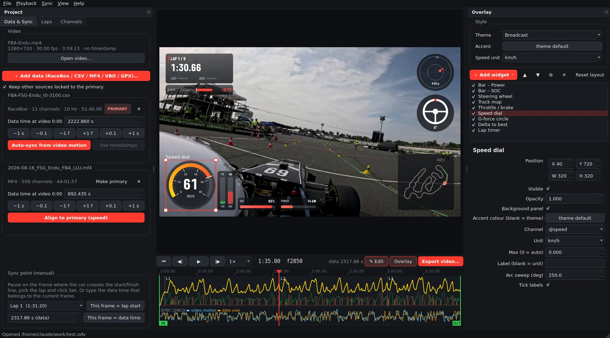
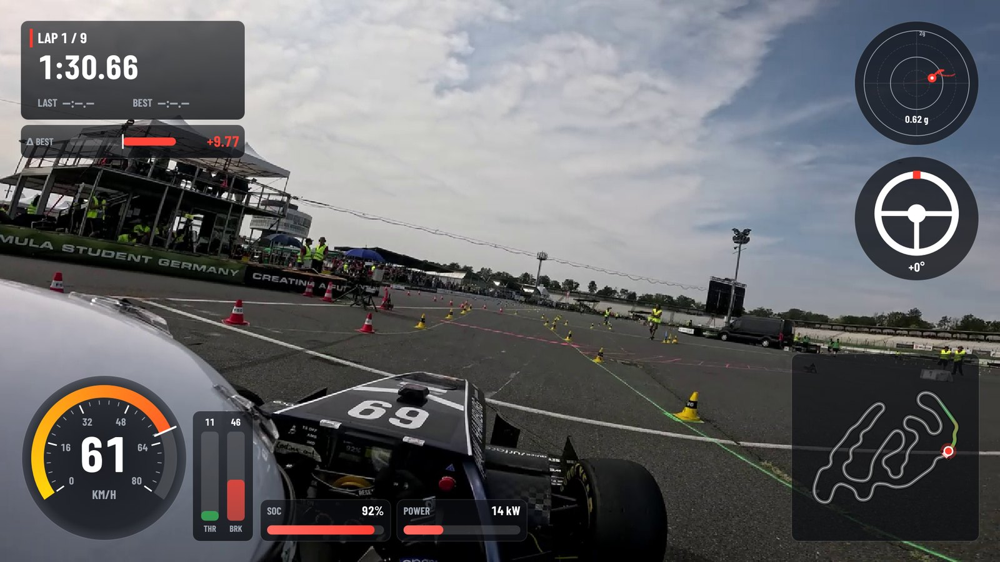
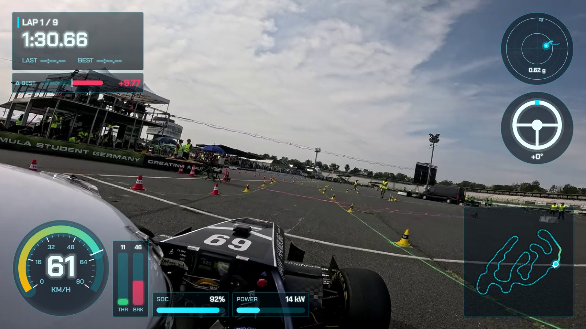
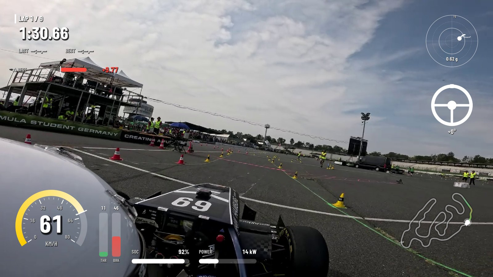

# Onboard DataVis

Telemetry overlays for onboard racing video, in the spirit of RaceRender. Load a video and a
data log, let the app sync them, lay out gauges on the preview, and render a finished MP4 or a
transparent overlay for your video editor.

Built for **RaceBox** data first. It also reads any **CSV**, **ASAM MF4/MDF** CAN or ECU logs,
**Racelogic VBO** and **GPX**. Videos without timestamps are no problem: the app can sync from the
camera's motion.



| Broadcast | Motorsport HUD | Minimal |
| --- | --- | --- |
|  |  |  |

<sub>Footage: Formula Student Germany 2026 endurance, Hockenheim. RaceBox Mini plus the car's MF4 CAN log.</sub>

## Features

- **Import** – RaceBox CSV (all export presets), generic CSV/TSV with an import dialog, MF4/MDF
  through [asammdf](https://github.com/danielhrisca/asammdf) (hundreds of channels, loaded on
  demand, CAN glitch filtering), VBO including its start/finish gate, and GPX.
- **Sync**
  - *Timestamps* – video creation time vs. the log's UTC start. Camera clocks set to local time
    are corrected automatically.
  - *Video motion* – camera yaw from optical flow, matched against gyro Z or GPS heading. Works on
    re-encoded or edited clips that have no metadata.
  - *Log to log* – speed cross-correlation aligns e.g. a car's MF4 to the GPS logger.
  - *Manual* – nudge by ±1 frame / 0.1 s / 1 s, or set sync points ("this frame = start of lap 3").
    A sync-check lane on the timeline shows video motion against the data.
- **Laps** – from the logger's lap channel or a start/finish gate you place. Lap table, best
  lap, and a live delta to best based on distance.
- **Widgets** – speed dial, value, bar, throttle/brake, G-force circle with trail, track map
  with speed-coloured trail, lap timer, delta bar, rolling graph, steering wheel, text,
  image/logo. Every widget can be dragged, resized and restyled. Channels are picked via roles
  (`@speed`, `@throttle`, …).
- **Themes** – Broadcast, Motorsport HUD, Minimal, with a custom accent colour.
- **Export** – FFmpeg with automatic NVIDIA NVENC / Intel Quick Sync / AMD AMF detection and an
  x264 fallback. Upscaling (e.g. 720p source → 1080p output for crisper gauges). Transparent
  ProRes 4444 or PNG sequence. Export the whole video, the trim range or a single lap.
- **Command line** for batch work: create a synced project, render, grab stills.

## Install

Requires **Python 3.10+**. FFmpeg comes from `imageio-ffmpeg` automatically. An `ffmpeg` on your
PATH is preferred when present, e.g. a build with hardware encoders.

### Windows (easiest)

Double-click **`Start Onboard DataVis.bat`**. The first run creates a `.venv` and installs the
dependencies. After that the app starts directly. `Start (debug console).bat` shows errors in a
console window.

### Any platform

```bash
git clone https://github.com/<your-user>/onboard-datavis.git
cd onboard-datavis
python -m venv .venv
# Windows: .venv\Scripts\activate    macOS/Linux: source .venv/bin/activate
pip install -e .            # or: pip install -r requirements.txt
onboard-datavis             # or: python -m odv
```

## Workflow

1. **File ▸ Open video…**
2. **＋ Add data…** – RaceBox files are detected automatically. Other CSVs open a short dialog
   to confirm the time column and units.
3. **Sync** – if the timestamps don't line up, the app offers *Auto-sync from video motion*.
   Extra logs, such as an MF4, are aligned to the primary log by speed.
4. **Check** – play it back and watch the *Sync check* lane. Fine-tune with `[` / `]` or a sync
   point.
5. **Layout** – with *✎ Edit* on, drag and resize gauges. Configure them in the *Overlay* panel.
6. **Export video…**

Save the project as `.odv` (JSON, paths relative to the project file) to keep the sync and layout.

## Supported data

| Format | Details |
| --- | --- |
| RaceBox CSV | RaceRender / Telemetry Overlay / custom presets. Lap column, G-forces, gyro. Speed unit is checked against GPS. |
| Generic CSV / TSV | Any delimiter. Metadata lines before the header are skipped. Time as seconds, ms, µs, clock time, ISO date-time or epoch. |
| MF4 / MDF / DAT | Decoded channels via asammdf. Duplicate CAN names are kept as `name #group`. Speed, throttle, brake, steering, RPM, SOC and power are guessed from names. |
| VBO | Racelogic and RaceBox. Minutes-based lat/long with the +West sign, `[laptiming]` gate. |
| GPX | Track points with time. Speed is derived from GPS. |

## Keyboard shortcuts

| Key | Action |
| --- | --- |
| Space | Play / pause |
| ← / → | Frame step (moves the selected widget in edit mode) |
| Shift + ← / → | ±1 s |
| `[` / `]` | Shift data −/+ 1 frame |
| Shift + `[` / `]` | Shift data −/+ 0.1 s |
| I / O | Trim in / out |
| E / H | Toggle layout editing / hide overlay |
| Ctrl + wheel | Zoom timeline (Shift + wheel pans, Z resets) |
| Ctrl+S / Ctrl+E | Save / export |

## Command line

```bash
python -m odv new video.mp4 racebox.csv car.mf4 -o session.odv   # auto-sync + default layout
python -m odv render session.odv out.mp4 --width 1920 --start 60 --end 150
python -m odv render session.odv overlay.mov --transparent prores4444
python -m odv still session.odv 95.0 frame.png
```

## Project layout

```
odv/
  data/      model (channels, sources, roles), loaders, lap timing + delta
  sync.py    timestamp / motion / cross-correlation sync
  render/    themes, widgets, renderer, FFmpeg export
  ui/        Qt editor: preview canvas, timeline, panels, dialogs
  project.py .odv project file
tests/       pytest suite with synthetic data (no sample files needed)
```

Run the tests with `python -m pytest -q`. Set `ODV_SAMPLE_CSV=path/to/racebox.csv` to also
run a smoke test on a real export.

## Roadmap

- GoPro GPMF parsing for frame-accurate GPS time
- Audio in the preview, undo/redo
- Gear indicator / shift lights, lean angle, lap comparison split-screen
- One-click Windows build (PyInstaller)

## License

[GPL-3.0-or-later](LICENSE) © 2026 Jasper Schöler

Bundled fonts: [Barlow Condensed](odv/assets/fonts/OFL-BarlowCondensed.txt) and
[Chakra Petch](odv/assets/fonts/OFL-ChakraPetch.txt), SIL Open Font License 1.1.
Main dependencies: PySide6 (LGPL-3.0), asammdf (LGPL-3.0), PyAV (BSD), OpenCV (Apache-2.0),
FFmpeg (LGPL/GPL, depending on the build).
